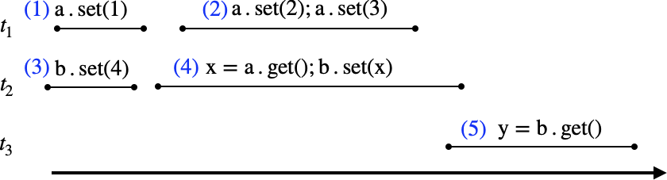

# Ficha de Exercícios 6

__[Programação Concorrente (CC3037)](https://www.dcc.fc.up.pt/~edrdo/aulas/pc), DCC/FCUP__

_Eduardo R. B. Marques, DCC/FCUP_ 

**Objectivos**: Exercícios sobre "Software Transactional Memory" (STM).

&rarr; [Documentação ScalaSTM](https://nbronson.github.io/scala-stm/api/0.8/scala/concurrent/stm/japi/STM$.html)

&rarr; Use scripts __compile.sh__ e __run.sh__ para compilar ou executar código.

## 1

Considere a seguinte história de transações numeradas de $(1)$ a  $(5)$, executadas por 3 threads - $t_1$, $t_2$, e $t_3$ - e envolvendo dois registos $a$ e $b$. Observe que as transações $(2)$ e $(4)$ envolvem mais do que uma operação sobre $a$ e $b$. Assuma que os registos $a$ e $b$ têm valor inicial $0$. 
  

1. Considerando execuções __serializáveis__ das transações, faça uma análise da possível evolução de __visões consistentes__ (i.e. observáveis numa execução correcta) de $[a,b]$ e também dos possíveis valores lidos $x$ e $y$ nas transações (4) e (5).

2. Assumindo que as leituras e escritas executam fora do contexto de uma transação na história apresentada (mas que são atómicas individualmente), dê exemplo de uma história linear expressa em termos de uma ordem de operações que corresponda a uma execução __linearizável__ e que seja diferente no seu efeito de todas as execuções serializáveis da alínea anterior. 

## 2 

O tipo [__TArray.View__](https://nbronson.github.io/scala-stm/api/0.8/scala/concurrent/stm/TArray$$View.html) representa um array transacional com operações de leitura e escrita atómica. 
O seu funcionamento é bastante simples:

- Uma instância __a__ de __TArray.View__ de tamanho __n__ é criada com __a = STM.newTArray(n);__
- __a.length()__ devolve o tamanho imutável de __a__, isto é, o tamanho __n__ especificado aquando da criação do array;
- __a.apply(pos)__ lê atomicamente a posição __pos__ de __a__;
- __a.update(pos,x)__ escreve atomicamente __x__ na posição __pos__ de __a__.

Considere o esqueleto dado para uma fila de capacidade limitada bloqueante em __CABlockingQueue__, implementada usando o esquema usual de "array circular". Complete a implementação tendo em conta que as operações __add()__ e __remove()__ deverão bloquear respectivamente quando a fila estiver cheia e vazia.

Pode executar __./run.sh pc.stm.TestEx2__ para testar a sua implementação, adaptando o código do método __main__ se achar necessário.

## 3

Em __LLBlockingDeque__ é dada o esqueleto da implementação de uma "double-ended queue (deque)" usando listas duplamente ligadas, disponibilizando os tradicionais métodos __addFirst() / addLast()__ e __removeFirst() / removeLast__.

Defina o código de __addFirst()__ e __removeLast()__ em falta.
Á semelhança de __removeLast()__ o método __removeFirst()__ deverá ser bloqueante quando uma "deque" estiver vazia.

Pode executar __./run.sh pc.stm.TestEx3__ para testar a sua implementação, alterando no código do método __main__ a chamada a __test1()__ para __test2()__. 
Nos dois "testes" as remoções pela thread __t3__ deverão retornar elementos na ordem __0, ..., 99__.

 

